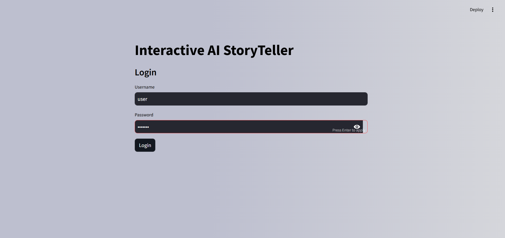

# Interactive AI StoryTeller

**Interactive AI StoryTeller** is a project developed during my 2-month Infosys Springboard Internship. The application takes multiple sequential images uploaded by the user, generates captions using the BLIP model, and then creates a cohesive, continuous story using GPT-3.5. It showcases the integration of advanced AI models for generating creative, narrative-driven content based on user-provided images.

## Project Overview

This project demonstrates the use of AI technologies in generating an interactive storytelling experience. The main features include:

- **Image Captioning**: Using the BLIP model to generate captions for each uploaded image.
- **Story Generation**: Using OpenAI's GPT-3.5 model to create a cohesive and continuous story from the generated captions.
- **User Authentication**: A simple login system to secure access.
- **Streamlit Interface**: A user-friendly web interface built with Streamlit for uploading images and viewing the generated story.

## Tech Stack

- **Frontend**: Streamlit (Python-based web framework)
- **Backend**: PyTorch (for the BLIP model), OpenAI's GPT-3.5 API
- **Models Used**:
  - **BLIP** (for image captioning)
  - **GPT-3.5** (for story generation)

## Features

- **User Login**: Secure access with username and password validation.
- **Image Upload**: Upload multiple images to be used as input for story generation.
- **Caption Generation**: Automatic captioning for each uploaded image using the BLIP model.
- **Cohesive Story Generation**: A continuous and interconnected story created from the captions using GPT-3.5.
- **Interactive Interface**: A visually appealing interface for an enhanced user experience.

## Project Structure

```
Interactive-AI-StoryTeller/
├── app.py
├── requirements.txt
├── README.md
└── assets/
    └── screenshots/
```

## Setup and Installation

Follow these steps to set up the project locally:

### Prerequisites

- Python 3.7+
- Streamlit
- OpenAI API Key

### Installation

1. **Clone the repository:**
   ```bash
   git clone https://github.com/username/Interactive-AI-StoryTeller.git
   cd Interactive-AI-StoryTeller
   ```

2. **Install required packages:**
   ```bash
   pip install -r requirements.txt
   ```

3. **Set up OpenAI API key:**
   - Replace the `openai.api_key` in `app.py` with your own OpenAI API key.
   ```python
   openai.api_key = "your-api-key-here"
   ```

4. **Run the Streamlit app:**
   ```bash
   streamlit run app.py
   ```

## Example Interface

> **Note**: Add screenshots of your application's interface here.

- **Login Page**  
  
    

- **Image Upload and Story Generation**  
  

- **Generated Story**  
  
  

## How It Works

1. **Login**: The user logs into the application with a valid username and password.
2. **Upload Images**: The user uploads a sequence of images they want to generate a story for.
3. **Generate Captions**: The BLIP model processes each image to create descriptive captions.
4. **Create Story**: The captions are fed to GPT-3.5, which generates a cohesive and continuous narrative.
5. **View Story**: The generated story is displayed in a formatted container for easy reading.

## Project Goals

The main goal of this project was to explore the integration of image captioning and story generation models. It demonstrates how AI can be used to transform visual inputs into coherent and engaging narratives, showcasing the capabilities of modern machine learning models.

## Future Enhancements

- **Improved Image Analysis**: Integrate advanced image feature extraction for more accurate captions.
- **Enhanced Storytelling**: Use newer LLMs for more vivid and creative story generation.
- **User Interaction**: Allow users to input text prompts to influence the story direction.

## Credits

- **Infosys Springboard Internship**: This project was developed as part of the Infosys Springboard Internship program.
- **Models**:
  - BLIP (Salesforce) for image captioning
  - OpenAI's GPT-3.5 for text generation